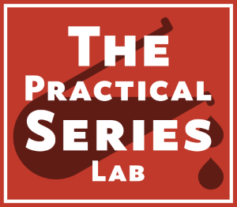

# A PracticalSeries Publication

    

The **Practical Series of publications** is a website resource for web developers and engineers. It contains a number of online publications designed to help and explain how to build a website, how to use version control and how to write engineering software for control systems.
This particular repository is designed as an example project to demonstrate how to build a Git and GitHub repository using the Brackets-Git extension for the Brackets text editor.
The full set of PracticalSeries publications is available at [practicalseries.com](http://practicalseries.com "Practical Series Website").

## How to use this repository
This repository is a worked example demonstrating how to build a version control project using Git and GitHub from within the Brackets text editor.
This repository is intended to be used with the accompanying documentation [practicalseries Git and GitHub](http://practicalseries.com/0021-git-vcs/index.html "Practical Series - Git and GitHub").

## Website contents
This site contains the following pages:
* index.html
* 01-intro.html
* 02-about.html
* 03-contact.html

## Contributors
This repository was constructed by [Michael Gledhill](https://github.com/practicalseries-lab "Michael Gledhill").

## Licence
This is simply a demonstration repository, the contents are free to use by anyone who wishes to do so.
